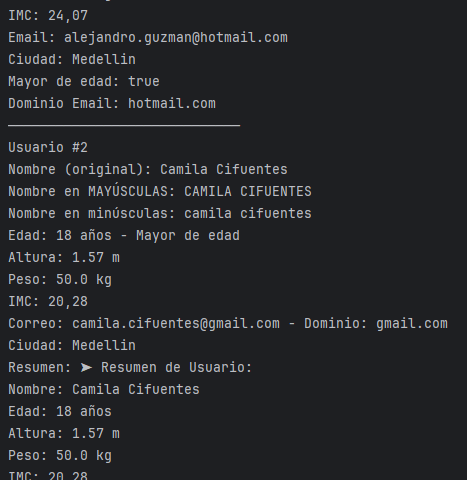

# 👨💻 Proyecto Kotlin - Gestor de Información Personal
*Autor:* David Herrera

## Descripción

Este proyecto es una **aplicación de consola escrita en Kotlin** que permite registrar, validar y analizar información personal de varios usuarios. Fue desarrollada como práctica para reforzar conceptos clave como:

- Variables y constantes
- Tipos de datos
- Operadores aritméticos, lógicos y relacionales
- Validaciones y manipulación de cadenas
- Estructuras de control y clases (`data class`) en Kotlin

## Funcionalidades

- ✅ Registro manual de exactamente *3 usuarios* desde la consola.
- ✅ Validación de datos ingresados:
    - Edad debe ser mayor que 0.
    - Altura y peso deben ser mayores que 0.0.
    - Correo debe contener al menos un `@` y un `.`.
- ✅ Cálculo del **IMC** (`peso / (altura²)`) y formato con 2 decimales.
- ✅ Evaluación de mayoría de edad (usuarios con edad ≥ 18).
- ✅ Manipulación de cadenas:
    - Conversión del nombre a **mayúsculas** y **minúsculas**.
    - Extracción del **dominio del correo electrónico**.
    - Generación de un resumen con toda la información del usuario usando `string templates` y `trimIndent()`.
- ✅ Presentación clara y organizada de la información de todos los usuarios al final del registro.

## Ejecutar el proyecto

1. Abra el proyecto en el editor de código (recomendado: *IntelliJ IDEA*).
2. Abre y ejecuta el archivo `Main.kt`.
3. Ingresa los datos solicitados por consola.
4. Revisa la salida estructurada con toda la información calculada y validada.

## Ejemplo de Ejecución

### Resultados mostrados en consola
Haz clic en la imagen para ampliarla:

